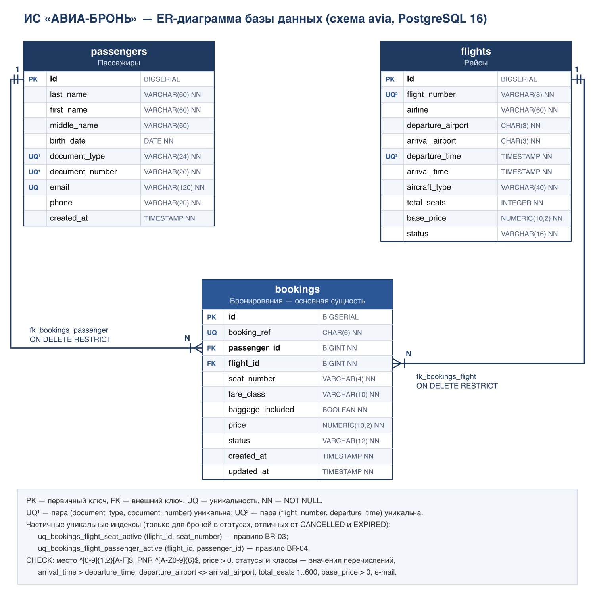
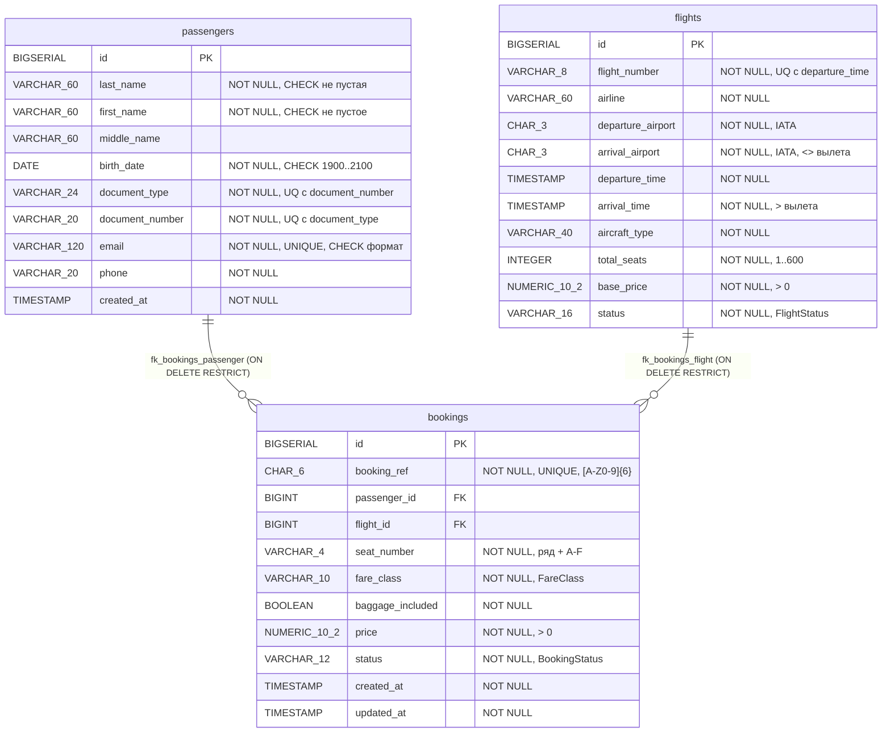

# ER-диаграмма базы данных

Схема `avia`, PostgreSQL 16. Схему создаёт Flyway при старте приложения миграцией
[`db/migration/V1__initial_schema.sql`](../console-app/src/main/resources/db/migration/V1__initial_schema.sql).
Тот же DDL для ручного запуска через psql — [`console-app/sql/schema.sql`](../console-app/sql/schema.sql)
(`scripts/verify.py` проверяет, что оба файла совпадают).

Векторная версия — [er-diagram.svg](er-diagram.svg).

Та же модель в Mermaid (отрисовывается на GitHub / GitLab):

Связь «многие ко многим» между пассажирами и рейсами разрешается таблицей `bookings`,
которая является полноценной сущностью (место, класс, цена, статус, PNR).

Частичные уникальные индексы действуют только для броней в статусах, отличных от `CANCELLED` и `EXPIRED`:

| Индекс | Поля | Правило |
|---|---|---|
| `uq_bookings_flight_seat_active` | `flight_id, seat_number` | BR-03 — одно место на рейсе занято не более чем одной активной бронью |
| `uq_bookings_flight_passenger_active` | `flight_id, passenger_id` | BR-04 — у пассажира не более одной активной брони на рейс |

Кроме трёх таблиц предметной области, в схеме `avia` есть служебная таблица Flyway
`flyway_schema_history` — список применённых миграций (V1 — схема, V2 — демонстрационные данные).
На диаграмме она не показана.
